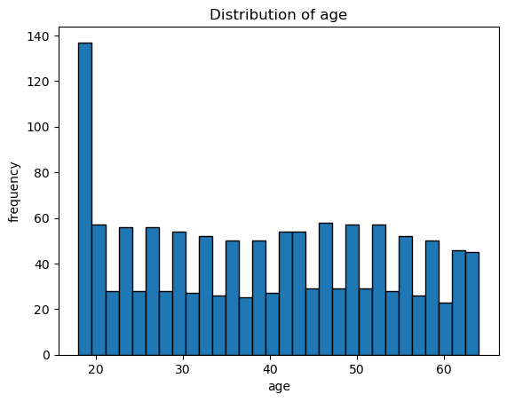
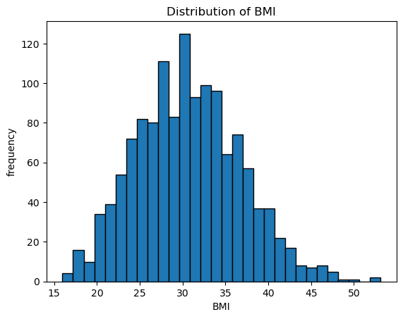
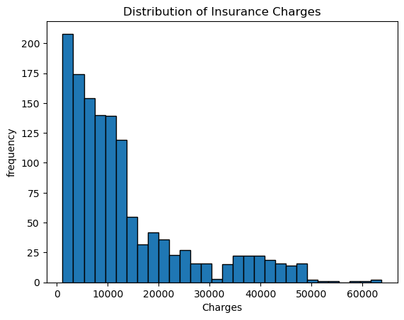
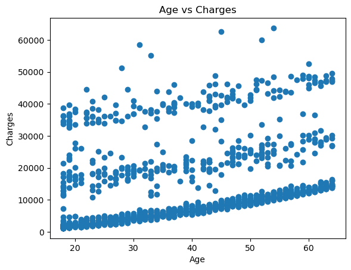
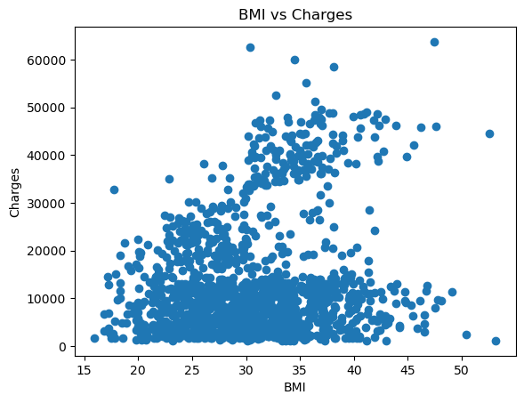
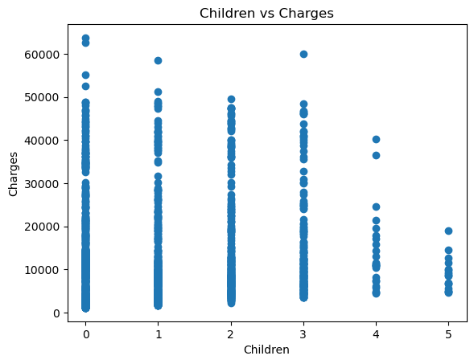

# Insurance Cost Analysis Using Statistics & Probability

## Project Overview

This project performs an end-to-end statistical analysis on an insurance dataset to understand what drives insurance costs. Using descriptive statistics, probability, hypothesis testing, and correlation analysis, the goal is to turn raw data into meaningful business insights.

## Project Structure

insurance-analysis/
│-- data/
│   └── insurance.csv
│-- notebooks/
│   └── analysis.ipynb
│-- images/
│   └── plots.png
│-- README.md

**Key Questions Answered:**

* How are insurance charges distributed?
* Who are the high-cost customers?
* What is the probability of risky profiles?
* Do lifestyle and demographic factors significantly affect charges?
* Which variables are most strongly related to insurance cost?

---

## Research Questions (From All Sections)

### Descriptive & Distribution Analysis

* Understanding overall customer cost behavior.
* What is the average insurance charge?
* How much do charges vary across customers?
* Is the distribution of charges skewed?
* Are there extreme high-cost customers?

### Probability Analysis

* What is the probability that a customer has high insurance charges?
* What is the probability that a customer is a smoker?
* What is the probability that a high-cost customer is a smoker?
* What is the probability that a high-cost customer is obese (high BMI ≥ 30)?

### Hypothesis Testing

* Do smokers pay significantly more than non-smokers?
* Is there a significant difference in charges between males and females?
* Are insurance charges significantly different across regions?
* Does BMI category significantly affect insurance charges?

### Relationship & Correlation Analysis

* Is BMI correlated with insurance charges?
* Is age correlated with insurance charges?
* Does number of children correlate with charges?

---

## Tools & Technologies

* Python
* Pandas, NumPy
* Matplotlib, Seaborn
* SciPy
* Jupyter Notebook / VS Code

---

## Dataset

**File:** `insurance.csv`
**Rows:** 1,338
**Columns:** 7

### Schema

| Column   | Type   | Description             |
| -------- | ------ | ----------------------- |
| age      | int    | Age of customer         |
| sex      | object | Male/Female             |
| bmi      | float  | Body Mass Index         |
| children | int    | Number of children      |
| smoker   | object | Smoking status (yes/no) |
| region   | object | Residential region      |
| charges  | float  | Insurance charges       |

---

## Data Cleaning

* Checked for missing values → None found
* Standardized smoker column using `.str.lower().str.strip()`
* Created BMI category column:

  * Underweight: < 18.5
  * Normal: 18.5 – 24.9
  * Overweight: 25 – 29.9
  * Obese: ≥ 30

---

## Descriptive & Distribution Analysis

### Summary Statistics

| Metric  | Age   | BMI   | Children | Charges   |
| ------- | ----- | ----- | -------- | --------- |
| Mean    | 39.21 | 30.66 | 1.09     | 13,270.42 |
| Std Dev | 14.05 | 6.10  | 1.21     | 12,110.01 |
| Min     | 18    | 15.96 | 0        | 1,121.87  |
| 25%     | 27    | 26.30 | 0        | 4,740.29  |
| Median  | 39    | 30.40 | 1        | 9,382.03  |
| 75%     | 51    | 34.69 | 2        | 16,639.91 |
| Max     | 64    | 53.13 | 5        | 63,770.43 |
---

| Variable | Variance    |
| -------- | ----------- |
| Age      | 197.40      |
| BMI      | 37.19       |
| Children | 1.45        |
| Charges  | 146,652,400 |

Charges show extremely high variance, meaning insurance costs differ widely across customers compared to other features.

| Variable | Skewness | Interpretation          |
| -------- | -------- | ----------------------- |
| Age      | 0.056    | Almost symmetric        |
| BMI      | 0.284    | Slightly right-skewed   |
| Children | 0.938    | Moderately right-skewed |
| Charges  | 1.516    | Highly right-skewed     |

Insurance charges are strongly right-skewed, showing a small group of very expensive customers.

### Distribution Plots

#### Age Distribution

#### BMI Distribution

#### Insurance Charges Distribution

**Insights:**

* Charges are heavily right-skewed.
* Small group of customers generate extremely high costs.

---

## High-Cost Customer Analysis

High-cost defined as top 10% (90th percentile).

| Metric              | Value      |
| ------------------- | ---------- |
| Threshold           | 34,831.72  |
| High-cost customers | 134 (~10%) |

### High-Cost Profile

| Attribute   | Result |
| ----------- | ------ |
| Smokers     | 97.76% |
| Non-smokers | 2.24%  |
| Male        | 62.69% |
| Female      | 37.31% |

**Conclusion:** High-cost customers are overwhelmingly smokers.

---

## Probability Analysis

| Event                        | Probability |
| ---------------------------- | ----------- |
| Customer is high-cost        | 10.01%      |
| Customer is smoker           | 20.48%      |
| High-cost customer is smoker | 97.76%      |
| High-cost customer is obese  | 96.27%      |

**Insight:** Smoking and obesity dominate high-cost risk.

---

# Hypothesis Testing (α = 0.05)

## 1. Do Smokers Pay Significantly More Than Non-Smokers?

| Metric  | Value     |
|--------|-----------|
| t-stat | 32.75     |
| p-value| 5.89e-103 |
| Result | Significant |

**Report:**  
Since p < 0.05, we reject the null hypothesis. Smokers pay significantly higher insurance charges than non-smokers. This difference is extremely strong and not due to random chance.

---

## 2. Is There a Significant Difference Between Males and Females?

| Metric  | Value     |
|--------|-----------|
| t-stat | 2.10      |
| p-value| 0.0358    |
| Result | Significant (moderate) |

**Report:**  
With p < 0.05, we reject the null hypothesis. Insurance charges differ significantly between males and females, although the effect size is moderate.

---

## 3. Are Charges Significantly Different Across Regions?

| Metric | Value   |
|-------|---------|
| F-stat| 2.97    |
| p-value| 0.0309 |
| Result| Significant |

**Report:**  
Because p < 0.05, we reject the null hypothesis. At least one region has a significantly different average insurance charge compared to others.

---

## 4. Does BMI Category Affect Insurance Charges?

| Metric | Value     |
|-------|-----------|
| F-stat| 18.73     |
| p-value| 6.66e-12 |
| Result| Highly Significant |

**Report:**  
Since p << 0.05, we strongly reject the null hypothesis. Insurance charges differ significantly across BMI categories, showing BMI as a major risk factor.

---

## Relationship & Correlation Analysis

| Variable Pair       | Correlation |
| ------------------- | ----------- |
| BMI vs Charges      | 0.198       |
| Age vs Charges      | 0.299       |
| Children vs Charges | 0.068       |

### Scatter Plots

#### Age vs Charges

#### BMI vs Charges

#### Children vs Charges

**Insights:**

* Age has moderate positive relationship.
* BMI has weak positive relationship.
* Children count has almost no effect.

---

## Final Business Insights

* Only ~10% customers drive extremely high costs.
* Smoking is the strongest cost driver.
* Obesity is second most important factor.
* Age increases cost moderately.
* Gender and region matter, but weakly.
* Number of children has negligible effect.

---

## Conclusion

This project demonstrates how statistical methods can transform raw insurance data into actionable insights. Lifestyle factors such as smoking and obesity dominate cost differences, far more than demographic or geographic factors. These insights can help insurers design better pricing, risk profiling, and preventive health programs.
